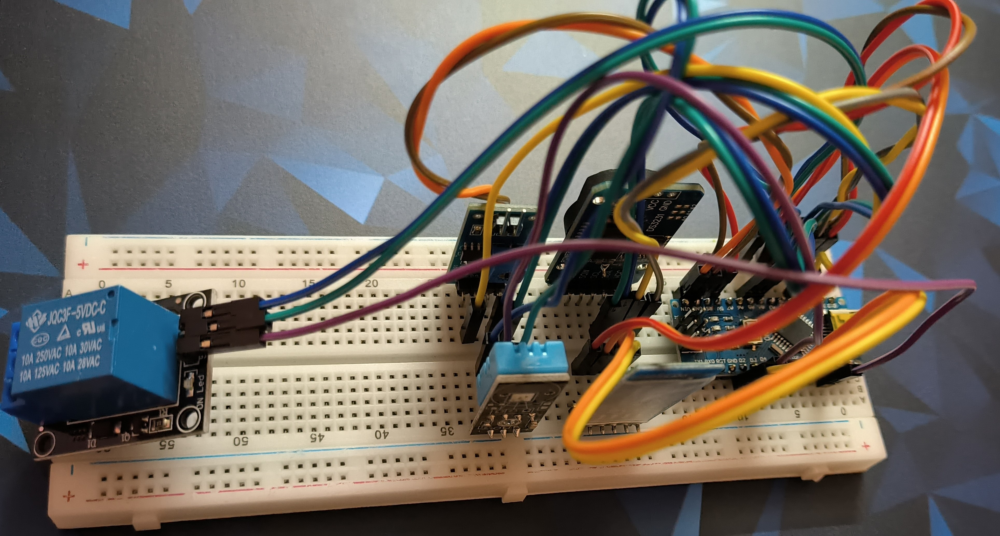
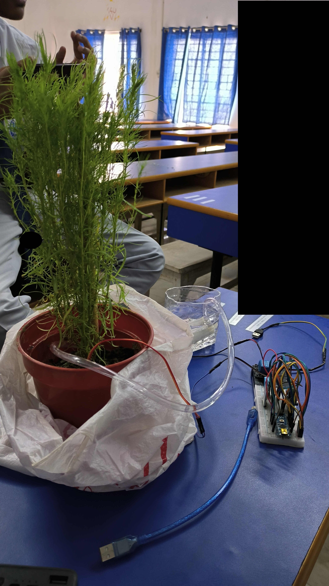

# Wireless Smart Farming System

An Arduino based project which uses HC-05 Bluetooth module for communicaton and automates irrigation in plants. 
 This system uses relay module, Soil Moisture sensor and DS3231 RTC module for its operation.
 Its consists of a user friendly CLI which can be navigated using a Bluetooth serial monitor of a device once connected.
 
 After a connection is established the system greets user with a welcome note and current time, temperature and soil moisture of the plant.
 It consists of an automatic irrigation system which can trigger a pump if it senses low soil moisture.
 The time of watering and sensitivity of the soil moisture can be changes in source code.
 This system uses the inbuilt temperature sensor present in RTC module to detect surrounding temperature.

## Picture of the project

